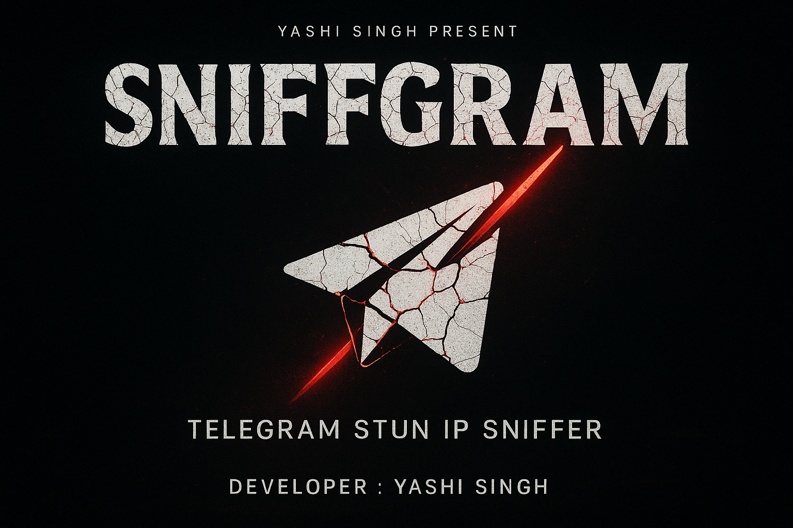

<p align="center">
  
</p>

# 🔍 Sniffgram 

A network analysis tool that captures and identifies XOR-mapped STUN IP addresses used by Telegram. This is useful for educational purposes, ethical hacking, and network diagnostics.

> ⚠️ For educational and research purposes only. Unauthorized use may violate terms of service or laws in your jurisdiction.

---

## 📜 Features

- Captures STUN packets using `pyshark` and `tshark`.
- Identifies and extracts XOR-mapped IP addresses.
- Performs WHOIS lookups and reverse DNS resolution.
- Excludes Telegram's official IP blocks from capture.
- Cross-platform compatible for Linux.

---

## 🧰 Requirements

- Install Telegram desktop client on Linux
- Python 3.6+
- `tshark` (from Wireshark suite)
- Internet connection (for IP resolution and WHOIS lookups)

---

## 🐍 Installation

### 1. Clone the Repository

```bash
git clone https://github.com/yashisingh26/Sniffgram.git
cd Sniffgram
chmod +x setup.sh
./setup.sh
